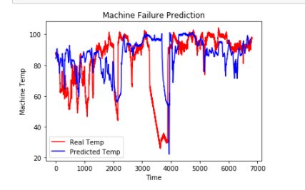

## PERFORMANCE ANALYSIS FOR ANOMALY DETECTIONIN MACHINE TEMPERATURES TO PREDICT FAILURE
• The data was split into 70% for training which included data from 2013 and few entries from 2014 and remaining 30% for testing, which was that of 2014.

• The first three LSTM layers had 30 units each with a dropout regularization of 20%

• The fourth LSTM layer had 50 units with a dropout regularization of 30%

• The final output layer had one unit. The model was generated using Adam optimizer and Mean Squared Error loss function.

• The training was split in batch size of 32 for 100 epochs. At the end of the 100th epoch the MSE loss was 2.3528e-04.

Graph of predicted machine temperatures in blue and the actual testing data machine temperatures in red.
